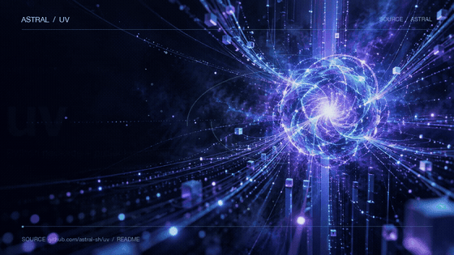

# Source to Motion

**Turn a project link or document into a short, original motion video. Keep the numbers honest.**



[Watch the uv MP4](examples/uv/preview.mp4) · [Watch the Word-brief dashboard MP4](examples/pulse-atlas/preview.mp4) · [中文说明](README.zh-CN.md)

Source to Motion is an open-source **agent skill**, not a hosted video service. Give your coding agent a GitHub repo, product site, PDF, Word document, or brief. The agent reads the source, chooses a visual concept, writes an editable animation, renders the MP4 locally, and checks every displayed figure against a saved evidence excerpt.

It provides a repeatable production workflow, source extraction, a fact manifest, a local Pillow/FFmpeg renderer, procedural audio, and a verification script. The finished style is designed for each source; the two included videos deliberately use different art directions.

## Try it with Codex

Requirements: Python 3.10+, FFmpeg on your `PATH`, and a coding agent able to run local Python. Optional image generation uses **your own** agent/tool access. The scripts themselves make no model API calls and need no API key.

```bash
git clone https://github.com/Balance0014/source-to-motion.git ~/.codex/skills/source-to-motion
python3 -m pip install -r ~/.codex/skills/source-to-motion/requirements.txt
ffmpeg -version
```

Open a new Codex chat and say:

> Use $source-to-motion to make a 12-second cinematic video from https://github.com/astral-sh/uv. Use source-backed wording and numbers. Deliver the MP4 and editable project.

You can replace the link with a product page, local PDF, Word file, or a brief. For formats the extractor cannot read directly, the agent can use its native file/vision tools and continue through the same fact and render workflow. A source that cannot be read cannot yield verified claims.

## What makes this useful

| Included | What it does |
| --- | --- |
| `SKILL.md` | Directs the agent from source to video, with a quality gate. |
| `scripts/ingest.py` | Extracts bounded text from GitHub, websites, PDF, DOCX, text files, and OCR images when Tesseract is available. |
| `facts.json` convention | Binds on-screen claims and numbers to exact source excerpts and locators. |
| `scripts/render.py` | Turns a source-specific Pillow scene into a shareable H.264 MP4 using local FFmpeg. |
| `scripts/sound.py` | Makes an original, optional electronic audio bed without a music subscription. |
| `scripts/verify.py` | Rejects missing evidence or new numbers, checks video metadata, and creates a contact sheet. |
| Two editable examples | Cinematic GitHub project teaser and a contrasting animated Word dashboard. |

The verifier is a guardrail, not a fact-checking oracle. It finds exact excerpts and catches numeric additions; the agent still needs to check meaning, units, attribution, legibility, pacing, and the actual video. A publisher's benchmark is labeled as that publisher's claim.

## Examples

| Input | Visual idea | Source-checked content |
| --- | --- | --- |
| [uv GitHub repository](https://github.com/astral-sh/uv) | Energy core with converging tool paths | Python package/project manager; one tool; uv's stated **10–100×** comparison to pip |
| [Fictional Word brief](examples/pulse-atlas/brief.docx) | Warm editorial incident dashboard | **2,480** events, **97.4%** auto-tagged, **12 min** median response, all marked synthetic demo data |

The [UV background art](assets/uv_energy.png) is generated artwork. Text and numbers are rendered in code, not baked into the image. The dashboard example uses only drawn shapes and type. Both videos include editable scenes, facts, source snapshots, MP4s, and contact sheets under `examples/`.

## Run the included example manually

```bash
python3 scripts/render.py --scene examples/uv/scene.py --facts examples/uv/facts.json --audio examples/uv/audio.wav --out /tmp/uv.mp4
python3 scripts/verify.py --video /tmp/uv.mp4 --facts examples/uv/facts.json --source-json examples/uv/source.json --contact-sheet /tmp/uv-contact.jpg
```

The direct renderer requires a scene file. The **skill** tells the agent to create that file for a new input. This is agent-driven automation, not a fixed template that can produce a professional video from any URL with one deterministic CLI call.

## Scope and limits

- Default target: 8–20 seconds. Rendering is local CPU/FFmpeg work; optional AI artwork uses the user's own model access.
- Text-based GitHub pages, ordinary websites, PDFs, DOCX, Markdown, and common images are supported directly when their text is readable. OCR requires Tesseract. Slide decks and unusual sources need the agent's native reader or conversion.
- Scanned, blocked, private, or misleading sources may require user-provided access or clarification. The agent must omit unsupported metrics.
- Current output is 2D motion graphics with H.264 video and optional procedural audio. There is no voiceover, 3D engine, or guaranteed studio-grade result for every source.
- Do not put private source snapshots in a public repository.

## Development

```bash
python3 -m unittest discover -s tests -v
```

Licensed under MIT. Example uv source content remains attributable to [Astral's uv project](https://github.com/astral-sh/uv). The Pulse Atlas brief is fictional test material.
