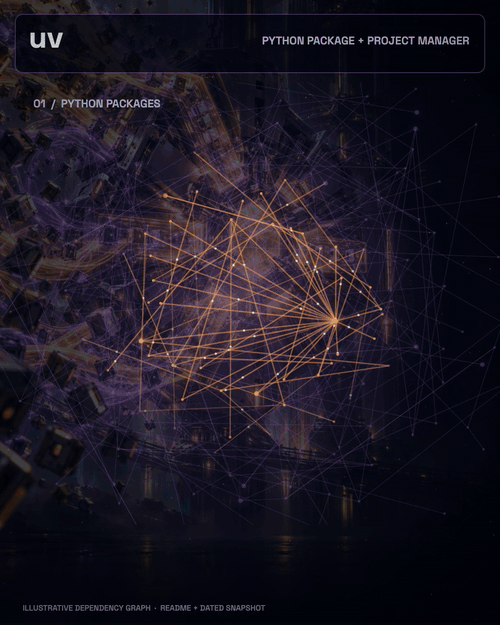

# Source to Motion

**English** · [简体中文](README.zh-CN.md)

**Turn a project link or document into a short, original motion video. Keep the numbers honest.**

[](examples/director-tests/README.md)

[Watch the content-directed films](examples/director-tests/README.md) · [First-generation GitHub films](examples/SHOWCASE.md) · [看中文仪表盘](examples/pulse-atlas-zh/preview.mp4)

The [first-generation gallery](examples/SHOWCASE.md) remains available for comparison.

Source to Motion is an open-source **agent skill**, not a hosted video service. Give your coding agent a GitHub repo, product site, PDF, Word document, or brief. The agent researches how the product works, chooses an original visual mechanism, writes an editable animation, renders the MP4 locally, and records displayed facts against source excerpts.

It provides a repeatable research and production workflow, source extraction, a fact manifest, local Pillow or optional browser-canvas rendering with FFmpeg, procedural audio, and a verification script. The [content-directed tests](examples/director-tests/README.md) exercise dependency traversal, analytical data flow, a private device mesh, builder-signal discovery, and recursive code search as different visual systems. The earlier six GitHub films share a dashboard composition and remain available as a first-generation baseline; they do not by themselves prove broad style diversity.

## Try it with Codex

Requirements: Python 3.10+, FFmpeg on your `PATH`, and a coding agent able to run local Python. Optional image generation uses **your own** agent/tool access. The scripts themselves make no model API calls and need no API key.

The [skills CLI](https://www.skills.sh/docs/cli) installs the small `skill-only` branch of **this same repository** into Codex. The gallery stays on `main`; the installed skill is about 0.3 MB and does not include the MP4 case studies:

```bash
npx skills add https://github.com/Balance0014/source-to-motion/tree/skill-only -g -a codex -y
```

Then install `requirements.txt` from the installed directory shown by the CLI and check FFmpeg:

```bash
ffmpeg -version
```

Open a new Codex chat and say:

> Use $source-to-motion to make a 12-second cinematic video from https://github.com/astral-sh/uv. Use source-backed wording and numbers. Deliver the MP4 and editable project.

To make a Chinese video from an English source, state the output language explicitly:

> Use $source-to-motion to turn this English product brief into a 10-second Chinese motion video. Keep the original evidence quotes and verify every translated metric.

You can replace the link with a product page, local PDF, Word file, or a brief. The user chooses the output language; if none is given, the skill follows the source language. For formats the extractor cannot read directly, the agent can use its native file/vision tools and continue through the same fact and render workflow. A source that cannot be read cannot yield verified claims.

## What makes this useful

| Included | What it does |
| --- | --- |
| [Installable SKILL.md](skill/source-to-motion/SKILL.md) and [art-direction criteria](references/art-direction.md) | Require domain research and an original input → mechanism → output visual decision before rendering. |
| `scripts/ingest.py` | Extracts bounded text from GitHub, websites, PDF, DOCX, text files, and OCR images when Tesseract is available. |
| `facts.json` convention | Binds on-screen claims and numbers to exact source excerpts and locators. |
| `scripts/render.py` and optional `scripts/render_browser.py` | Turn an authored Pillow or browser-canvas scene into a shareable H.264 MP4 using local FFmpeg. |
| `scripts/sound.py` | Makes an original, optional electronic audio bed without a music subscription. |
| `scripts/verify.py` | Rejects missing evidence or new numbers, checks video metadata, and creates a contact sheet. |
| Editable case studies | Five content-directed films, the earlier GapMine and six GitHub films, and English and Chinese Word dashboards. |

The verifier is a guardrail, not a fact-checking oracle. It finds exact excerpts and catches numeric additions; the agent still needs to check meaning, units, attribution, legibility, pacing, and the actual video. A publisher's benchmark is labeled as that publisher's claim.

## Examples

### Content-directed stress tests

The newer [five-film set](examples/director-tests/README.md) includes four real GitHub projects and a GapMine remake. ripgrep was a held-out project selected after the first four films and the direction method were complete; its full-screen 9:16 search storm tests a different mechanism and aspect ratio. Every case includes a short direction brief explaining what was researched, why its visual mechanism was chosen over an alternative, and which imagery is illustrative. Their compositions, motion fields, and peripheral facts are authored separately. These are examples of the method, not selectable presets that can be applied to any project.

| Project | Visible product action | Film |
| --- | --- | --- |
| uv | Dependencies traverse a graph and settle into a lock structure | [watch](examples/director-tests/uv/preview.mp4) |
| DuckDB | CSV/Parquet streams pass through a SQL query plane and organize into rows | [watch](examples/director-tests/duckdb/preview.mp4) |
| Tailscale | Separated devices connect into an illustrative private mesh | [watch](examples/director-tests/tailscale/preview.mp4) |
| GapMine | Builder-source threads converge into a source-linked opportunity | [watch](examples/director-tests/gapmine/preview.mp4) |
| ripgrep | Recursive search filters a file storm into matching lines | [watch](examples/director-tests/ripgrep/preview.mp4) |

### Earlier examples

| Input | Visual idea | Source-checked content |
| --- | --- | --- |
| [GapMine public website](https://gapmine.com/) | Real builder discussions fly into a five-signal scoring structure; a source-linked example opportunity emerges | Homepage snapshot: **101,081** builder signals analyzed, **1,140** opportunity cards, **124** communities; [evidence](examples/gapmine/facts.json) |
| [uv GitHub repository](https://github.com/astral-sh/uv) | Package paths lock into a kinetic build core | Python package/project manager; Astral's qualified **10–100×** comparison to pip |
| [Ollama GitHub repository](https://github.com/ollama/ollama) | Open-model input lights an inference chamber | Open models, model chat, REST API |
| [Trivy GitHub repository](https://github.com/aquasecurity/trivy) | A scan plane exposes an artifact's security layers | Container images, CVEs, misconfigurations, secrets; no fictional finding counts |
| [DuckDB GitHub repository](https://github.com/duckdb/duckdb) | A query plane cuts through data columns | SQL queries over CSV/Parquet; no fictional result values |
| [Tailscale GitHub repository](https://github.com/tailscale/tailscale) | Separate device islands become a private mesh | Private WireGuard networks, daemon and CLI |
| [Excalidraw GitHub repository](https://github.com/excalidraw/excalidraw) | A suspended hand-drawn canvas builds a shared diagram | Infinite canvas, collaboration, PNG/SVG export |
| [Fictional Word brief](examples/pulse-atlas/brief.docx) | Warm editorial incident dashboard | **2,480** events, **97.4%** auto-tagged, **12 min** median response, all marked synthetic demo data |
| [Same English brief → Chinese video](examples/pulse-atlas-zh/preview.mp4) | Localized editorial dashboard | Same **2,480**, **97.4%**, and **12 分钟**, with original English evidence retained in [facts.json](examples/pulse-atlas-zh/facts.json) |

The GapMine example is a **16-second, 1080×1350 (4:5) unofficial concept film** designed for a mobile social-feed card and based on a [public homepage snapshot](examples/gapmine/source.json) captured on **8 October 2026 at 09:43 UTC**; its live counters will change. A giant market landscape with a buried gap is the central visual subject. Source streams converge; illumination travels down and across the gap while source-backed panels respond. Two generated art plates contain no factual text. Camera movement, localized reveal, signal veins, dashboard, and exact numbers are rendered in code. The scene is a visual metaphor, not a recording of GapMine software; no numerical score is invented.

The six first-generation [GitHub films](examples/SHOWCASE.md) use six different physical subjects and commit-pinned README excerpts, but share a perimeter dashboard layout. Each dashboard shows project-specific facts or commands plus Stars and Forks from a **dated 8 October 2026 UTC GitHub API snapshot**; the latter measure repository popularity, not product performance. Their generated art contains no factual text; claims are drawn from editable manifests. The illustrations are not screenshots, actual scan findings, actual query results, or real network topologies. The Word dashboard examples share one fictional brief. The Chinese scene includes an [OFL-licensed font subset](assets/fonts/README.md). Every example has an editable scene, fact manifest, MP4, and contact sheet under `examples/`.

## Run the included example manually

Clone the full repository when you want the editable gallery; this is separate from the small skill install. Run these commands from the repository root:

```bash
python3 examples/gapmine/sound.py
python3 scripts/render.py --scene examples/gapmine/scene.py --facts examples/gapmine/facts.json --audio examples/gapmine/audio.wav --out /tmp/gapmine.mp4
python3 scripts/verify.py --video /tmp/gapmine.mp4 --facts examples/gapmine/facts.json --source-json examples/gapmine/source.json --contact-sheet /tmp/gapmine-contact.jpg
```

The direct renderer requires a scene file. The **skill** tells the agent to create that file for a new input. This is agent-driven automation, not a fixed template that can produce a professional video from any URL with one deterministic CLI call.

To reproduce a content-directed browser scene, install the optional browser dependencies and Chromium once:

```bash
python3 -m pip install -r requirements-browser.txt
python3 -m playwright install chromium
python3 scripts/preview_browser.py --scene examples/director-tests/uv/scene.html --facts examples/director-tests/uv/facts.json --out /tmp/uv-contact.jpg
python3 scripts/render_browser.py --scene examples/director-tests/uv/scene.html --facts examples/director-tests/uv/facts.json --audio examples/director-tests/uv/audio.wav --out /tmp/uv-content-directed.mp4
```

For the Chinese sample, use `examples/pulse-atlas-zh/scene.py`, `examples/pulse-atlas-zh/facts.json`, and `examples/pulse-atlas/source.json`. See the [localization rules](references/localization.md) before translating product claims.

## Scope and limits

- Default target: 8–20 seconds. Rendering is local CPU/FFmpeg work; optional AI artwork uses the user's own model access.
- Text-based GitHub pages, ordinary websites, PDFs, DOCX, Markdown, and common images are supported directly when their text is readable. OCR requires Tesseract. Slide decks and unusual sources need the agent's native reader or conversion.
- Scanned, blocked, private, or misleading sources may require user-provided access or clarification. The agent must omit unsupported metrics.
- Current output is H.264 motion graphics, including authored canvas fields, generated art plates, 2.5D camera moves, spatial reveals, procedural subject layers, and optional original audio. There is no voiceover, full 3D engine, or guaranteed studio-grade result for every source.
- Do not put private source snapshots in a public repository.

Read the [privacy notes](PRIVACY.md) before using private sources, and use the [showcase issue form](https://github.com/Balance0014/source-to-motion/issues/new/choose) only for material you can publish.

## Development

```bash
python3 -m unittest discover -s tests -v
```

Licensed under MIT. The bundled Chinese sample font retains its [SIL Open Font License](assets/fonts/OFL.txt). Example uv source content remains attributable to [Astral's uv project](https://github.com/astral-sh/uv); the uv video is an unofficial demo. The Pulse Atlas brief is fictional test material.
